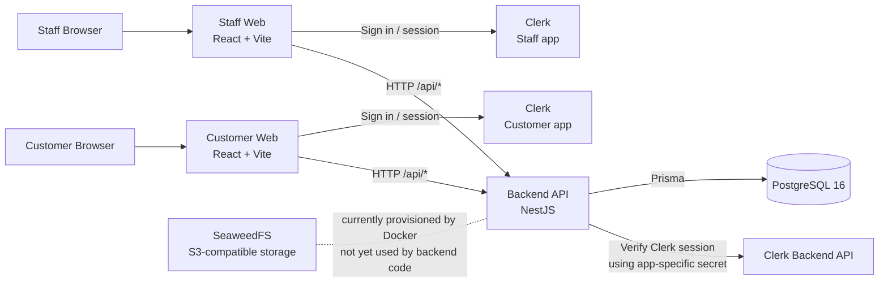

# Infrastructure Guide for Feature Groups

This guide describes the infrastructure and shared setup that every feature group (G01–G16) must understand before implementing a module.

It is written against the **current repository state**. Some project-standard tools are agreed at the project level but are not yet present in the current scaffold; those are marked explicitly below.

---

## 1. Overall Architecture

The system is a single repository containing one backend API and two independent frontend applications.



### What talks to what

| Component | Communicates with | Purpose |
|---|---|---|
| Customer Web | Clerk | Customer sign-in/sign-out |
| Staff Web | Clerk | Staff sign-in/sign-out |
| Customer Web | Backend API | Business data and authenticated API requests |
| Staff Web | Backend API | Business data and authenticated API requests |
| Backend | Clerk | Verifies frontend Clerk session tokens and reads user details when creating a local user |
| Backend | PostgreSQL | Application data, users, refresh tokens, and future module data |
| Backend | SeaweedFS (S3 API) | **Not yet integrated in the current codebase**; SeaweedFS is currently only provisioned by Docker Compose |

The backend exposes its API under the global prefix:

```text
/api
```

For example, the authentication endpoints currently include:

```text
POST /api/auth/session
POST /api/auth/refresh
POST /api/auth/logout
```

---

## 2. Project Stack

### Current repository stack

| Layer | Current implementation |
|---|---|
| Runtime | Node.js 24 (`.nvmrc`) |
| Package manager | npm workspaces |
| Backend | NestJS 11 + TypeScript |
| ORM | Prisma 7 |
| Database | PostgreSQL 16 |
| Authentication | Clerk + project-issued JWT access tokens + refresh-token cookies |
| Frontend | React 19 + Vite 8 + TypeScript |
| Frontend routing | TanStack Router |
| Object storage | SeaweedFS (S3-compatible; replaced MinIO), provisioned in Docker Compose but not yet connected to backend code |
| Local orchestration | Docker Compose |
| CI | GitHub Actions |
| Container base | Node 24 Alpine for backend builds; Nginx Alpine for frontend runtime images |

### Project-standard tools that are not yet present in this scaffold

The project has previously agreed to use the following for feature development, but the current `package.json` files do not yet install them:

- shadcn/ui
- Tailwind CSS
- Lucide icons
- TanStack Query for feature API/server-state access
- OpenAPI/Swagger

Do not assume these are available in the current checkout until the Dev/UI-UX Leads add them to the repository. Authentication code is an existing exception and currently uses direct `fetch` calls for the session/refresh flow.

---

## 3. Repository Setup

### Prerequisites

- Node.js 24 (use the repository `.nvmrc`). npm refuses to install on older versions (`EBADENGINE`); run `nvm use` and try again.
- npm
- Docker Desktop or Docker Engine + Compose **2.23.1 or newer** (check with `docker compose version`; the SeaweedFS setup needs it)
- Git

### Clone

```bash
git clone <repository-url>
cd airline-management-system
```

Use the project's GitHub organization repository URL supplied by the Management/Infra Leads.

### Install dependencies

From the repository root:

```bash
npm install
```

For a clean CI-style install:

```bash
npm ci
```

Run `npm install` again **every time you pull** changes. It also regenerates the Prisma client from `schema.prisma`; a stale client shows up as backend build errors about missing tables or fields.

### Configure local environment variables

Backend:

```bash
cp apps/backend/.env.example apps/backend/.env
```

Customer web:

```bash
cp apps/customer-web/.env.example apps/customer-web/.env
```

Staff web:

```bash
cp apps/staff-web/.env.example apps/staff-web/.env
```

At minimum, the backend requires values for:

```text
DATABASE_URL
PORT
NODE_ENV
ACCESS_TOKEN_SECRET
ACCESS_TOKEN_TTL_SECONDS
REFRESH_TOKEN_TTL_DAYS
CLERK_SECRET_KEY_CUSTOMER
CLERK_SECRET_KEY_STAFF
```

The frontends require:

```text
VITE_CLERK_PUBLISHABLE_KEY
VITE_API_URL
```

The customer and staff applications must use **different Clerk applications** and therefore different Clerk publishable/secret keys.

Where the values come from:

| Value | Source |
| --- | --- |
| Clerk publishable and secret keys | The shared development Clerk applications. Infra Leads hand out the keys privately (never in Git, chat, or issues). |
| `ACCESS_TOKEN_SECRET` | Generate your own: `openssl rand -hex 32` |
| Everything else | The defaults in `.env.example` work for local development |

### Troubleshooting local setup

| Symptom | Cause and fix |
| --- | --- |
| `npm install` fails with `EBADENGINE` | Wrong Node version. Run `nvm use`, then install again. |
| Backend build errors about missing tables or fields | Stale Prisma client after a pull. Run `npm install`. |
| A frontend shows a **blank page** | Check the browser console. A placeholder or wrong `VITE_CLERK_PUBLISHABLE_KEY` makes Clerk throw before anything renders. |
| Two `401` errors from `*.clerk.accounts.dev` in the console on the first page load | Harmless. Both apps run on `localhost`, so their Clerk dev cookies collide; Clerk recovers by itself. Does not happen in production. |

### Start local infrastructure

```bash
npm run db:up
```

This starts:

- PostgreSQL 16 on `localhost:5432`
- SeaweedFS S3 API on `localhost:8333`
- A one-shot initialization container that creates the `airline-public` and `airline-private` buckets (it exits with code 0 when done; that is expected)

Local S3 details, for when file storage is added to the backend:

| Setting | Local value |
| --- | --- |
| Endpoint | `http://localhost:8333` (path-style addressing, e.g. `forcePathStyle: true` in the AWS SDK) |
| Access key / secret key | `devaccesskey` / `devsecretkey` (local only, set in `docker-compose.yml`) |
| `airline-public` | Anyone can read and list; only the app credentials can write |
| `airline-private` | App credentials only; give browsers time-limited presigned URLs |

### Start all applications

```bash
npm run dev
```

Current local application ports:

| Application | URL |
|---|---|
| Backend API | `http://localhost:8080` |
| Customer Web | `http://localhost:5151` |
| Staff Web | `http://localhost:6161` |
| PostgreSQL | `localhost:5432` |
| SeaweedFS S3 API | `http://localhost:8333` |

### Start one application

```bash
npm run start:dev -w apps/backend
npm run dev -w apps/customer-web
npm run dev -w apps/staff-web
```

### Database commands

```bash
npm run db:migrate
npm run db:migrate:deploy
npm run db:migrate:reset
npm run db:studio
npm run db:seed
```

The Prisma configuration resolves the schema at:

```text
apps/backend/src/db/prisma/schema.prisma
```

---

## 4. Authentication: End-to-End Flow

There are two authentication layers:

1. **Clerk** handles the browser-facing sign-in session.
2. **The Airline backend** issues its own short-lived access token and rotating refresh token for API access.

### Customer and staff isolation

The customer and staff frontends each have their own Clerk application and their own refresh-token cookie name:

```text
Customer: refresh_token_customer
Staff:    refresh_token_staff
```

The backend also maps each frontend origin to its corresponding Clerk secret and user type:

```text
http://localhost:5151 -> customer
http://localhost:6161 -> staff
```

### Initial sign-in/session exchange

1. The user signs in through Clerk in the frontend.
2. The frontend obtains a Clerk session token.
3. The frontend sends that token to:

```text
POST /api/auth/session
```

4. The backend identifies the requesting frontend from the `Origin` header.
5. The backend verifies the Clerk session token using that app's Clerk secret key.
6. If this is the user's first login, the backend creates the local `user` record and either a `customer` or `staff` record.
7. The backend issues:
   - a short-lived JWT access token
   - a long-lived refresh token
8. The refresh token is stored **hashed** in PostgreSQL and sent to the browser in an `HttpOnly` cookie.
9. The access token is returned to the frontend and used as:

```http
Authorization: Bearer <access-token>
```

### Authenticated API requests

Normal protected backend routes are guarded globally by `JwtAuthGuard`.

The guard reads the Bearer token, verifies the JWT signature/expiry, and places the authenticated user ID/email on the request.

Feature developers should therefore treat authenticated backend requests as carrying a server-verified user identity. Do not implement a second JWT verification mechanism inside each feature module.

### Access-token refresh

When an access token expires, the frontend calls:

```text
POST /api/auth/refresh
```

The backend:

1. Reads the app-specific refresh-token cookie.
2. Hashes the raw token and looks it up in PostgreSQL.
3. Rejects missing, expired, or revoked tokens.
4. Issues a new access token and refresh token.
5. Revokes the old refresh token and records its replacement.

Reuse of a revoked refresh token is treated as token reuse/theft and revokes the user's remaining active refresh tokens.

### Logout

```text
POST /api/auth/logout
```

The backend revokes the current refresh token and clears the appropriate cookie. The frontend then signs out from Clerk as well.

### What feature groups need to do

Feature groups normally **do not create their own authentication system**.

Backend features should rely on the existing global auth guard and request user information. Frontend features should use the existing app authentication context rather than building their own login/token storage flow.

#### Backend: protected and public routes

Every route requires a valid access token **by default**; a request without one gets `401`. Mark the rare route that must work signed-out with `@Public()`, and read the signed-in user with `@CurrentUser()`:

```ts
import { Controller, Get } from '@nestjs/common'
import { Public } from '@backend/auth/decorators/public.decorator'
import { CurrentUser } from '@backend/auth/decorators/current-user.decorator'
import type { AuthenticatedUser } from '@backend/auth/guards/jwt-auth.guard'

@Controller('flights')
export class FlightsController {
  @Public()
  @Get('search')
  search() {
    // open to everyone
  }

  @Get('mine')
  mine(@CurrentUser() user: AuthenticatedUser) {
    // user.id and user.email are verified by the global guard
  }
}
```

`AuthenticatedUser` currently contains only `id` and `email`. It does **not** say whether the user is a customer or staff member, so do not build customer-only or staff-only rules on it until the Dev Leads add the user type.

#### Frontend: calling the API

Inside pages under `src/routes/_authenticated/`, use the `useAppAuth()` hook from `src/auth/AuthProvider.tsx`. It provides `user`, `isLoading`, `logout`, and `fetchWithAuth`:

```tsx
const { fetchWithAuth } = useAppAuth()
const res = await fetchWithAuth('/api/flights/mine')
```

`fetchWithAuth` prefixes `VITE_API_URL`, attaches the access token, and on a `401` refreshes the token once and retries. `useAppAuth()` only works inside the `_authenticated` routes, because that layout provides it; public pages call public endpoints with plain `fetch`.

### Known issues in the current auth code

These are known and owned by the Dev Leads. Do not work around them inside a feature; report anything new to the Dev Leads.

| Issue | What you may notice |
| --- | --- |
| Two refresh requests sent at the same moment can revoke the whole session | In local development (React StrictMode runs effects twice) you are occasionally signed out of the backend session and the app re-exchanges your Clerk session. |
| An invalid Clerk session token returns `500` instead of `401` | A `500` from `POST /api/auth/session` usually means a bad or expired Clerk token, not a server crash. |
| Access tokens do not carry the user type | See above: no customer-only or staff-only checks yet. |
| Soft-deleted users (`deleted_at` set) can still sign in and refresh | Do not rely on soft delete to block access. |

---

## 5. Environment Rules

### Never commit secrets

Do not commit real values for:

- Clerk secret keys
- Clerk publishable keys
- `ACCESS_TOKEN_SECRET`
- database passwords or other production credentials

Only `.env.example` files belong in Git.

### Frontend environment variables are build-time configuration

`VITE_*` variables are consumed by Vite during the frontend build. Changing `VITE_API_URL` or `VITE_CLERK_PUBLISHABLE_KEY` in a running Nginx container does not change the already-built JavaScript bundle.

For deployed frontend images, these values therefore need to be supplied at **image build time** (or the application needs a separate runtime configuration mechanism).

### Backend environment variables are runtime configuration

The backend validates the required environment variables when NestJS starts. A missing required value prevents the application from starting.

The check only confirms that each value is present. It does not check the values themselves: a non-number such as `ACCESS_TOKEN_TTL_SECONDS=15m` lets the backend start, then every login and refresh fails with `500`. Keep the numeric values plain numbers, as in `.env.example`.

---

## 6. Deployment

### Current container layout

The repository has Dockerfiles for:

```text
apps/backend/Dockerfile
apps/customer-web/Dockerfile
apps/staff-web/Dockerfile
```

The production Compose file currently defines:

```text
postgres
seaweedfs
backend
customer-web
staff-web
```

Current container ports exposed by Compose:

```text
5432  PostgreSQL (VM loopback only)
8333  SeaweedFS S3 API (VM loopback only)
8080  Backend API
5151  Customer Web
6161  Staff Web
```

### Current deployment flow

The intended deployment flow is:

```text
group feature branch
        |
        v
       PR -> dev
        |
   CI checks pass
        |
   Dev Leads merge
        |
        v
      dev branch
        |
 release PR (dev -> main)
        |
   Infra Leads merge
        |
        v
 build + push images to Docker Hub (manual, Infra Leads)
        |
 pull images + deploy Compose stack on the VM
```

CI (`.github/workflows/ci.yml`) runs on every pull request targeting `dev` or `main`. Its jobs:

| Job | What it checks |
| --- | --- |
| `lint-test-build` | Production dependencies have no high/critical `npm audit` findings; then, for each app: lint, Prettier formatting, backend tests, build |
| `database` | All migrations apply to an empty PostgreSQL 16, the result matches `schema.prisma` (no schema change without a migration), and the seed script runs |
| `docker-build (backend / customer-web / staff-web)` | Each production Dockerfile still builds (images are not pushed) |

Lint and format checks only report problems; they never edit files. To fix them locally:

```bash
npm run lint:fix -w apps/<app>
npm run format -w apps/<app>
```

Dependabot alerts are enabled in the repository settings; Dependabot does not open PRs. When an alert or the CI audit step reports a vulnerable dependency, an Infra Lead updates it in a normal PR. Infra Leads also handle routine dependency upgrades deliberately.

### Important current deployment gaps

These are **not yet fully automated** in the repository:

1. Production images are not built or pushed by CI. CI only checks that each Dockerfile builds; an Infra Lead builds the three images and pushes them to the Docker Hub namespace in `DOCKERHUB_USER`, tagged with `IMAGE_TAG` (default `latest`).
2. The frontend production images need their `VITE_*` values at build time (`--build-arg VITE_CLERK_PUBLISHABLE_KEY=... --build-arg VITE_API_URL=...`), so each environment needs its own frontend images.
3. Database migrations are not automatically executed by the backend container startup command. Run `prisma migrate deploy` against the production database before starting a backend version that needs new migrations.
4. The backend reads the allowed frontend origins from `CUSTOMER_WEB_ORIGIN` and `STAFF_WEB_ORIGIN` (for CORS, cookie names, and choosing the Clerk app). The VM's `.env` must set both to the deployed frontend URLs. If either is missing, the backend still starts, but every sign-in and refresh from that app is rejected.
5. SeaweedFS is provisioned but the backend has no S3 client/integration code yet. In production the buckets are not created automatically; create them once by running `s3.bucket.create -name airline-public` and `s3.bucket.create -name airline-private` inside `weed shell` in the `seaweedfs` container. The VM's `.env` must set `S3_ACCESS_KEY` and `S3_SECRET_KEY`; `docker compose -f docker-compose.prod.yml` refuses to start without them.
6. The production Compose file binds PostgreSQL and SeaweedFS to the VM's loopback address only. Docker-published ports bypass `ufw`, so do not publish them on all interfaces unless that exposure is intentional.

Do not tell feature groups that deployment is fully automated until these pieces are resolved.

---

## 7. GitHub / Branch Rules

All feature development starts from `dev`.

```text
<type>/<team-id>-<short-description>
```

`type` is one of `feature`, `fix`, `refactor`, `chore`, `docs`, `test`. Example:

```text
feature/g03-seat-hold-ttl
```

Commits use:

```text
<type>(<team-id>): <description>
```

Example:

```text
feat(g03): add seat hold ttl
```

Feature groups open PRs into `dev`.

Current repository policy documented in `branch-naming-and-workflow.md`:

- 2 approvals + Code Owner review for group PRs into `dev`
- PRs use the PR template (`.github/pull_request_template.md`, filled in automatically when you open a PR)
- squash merge into `dev`
- release PRs come from `dev` to `main`
- Infra Leads merge releases into `main`

Before assuming a rule is enforced automatically, check the current GitHub branch rulesets and `CODEOWNERS`. Configuration can lag behind documentation.

---

## 8. Rules Feature Developers Must Follow

### Backend

- Work inside your assigned module folder once the feature-module skeleton is created.
- Do not create a second database/client layer for your module.
- Do not edit Prisma schema/migrations directly; the Database Team owns them.
- Do not implement a separate authentication mechanism.
- Do not import another module's internal files directly; use its exported NestJS interface.
- Keep API contracts explicit and coordinate cross-module changes with the affected teams.
- Put unit tests in `*.spec.ts` files next to the code they test (see `src/config/env.validation.spec.ts`). CI runs them with `npm run test -w apps/backend`. The frontends have no test runner yet.

### Frontend

- Customer and staff code belongs in the correct application.
- Keep feature code isolated from shared infrastructure.
- Use the project's chosen server-state/API pattern once the TanStack Query setup is added by the Dev Leads.
- Do not duplicate Clerk/session handling in individual feature pages.
- Keep application routing thin and put feature behavior inside the feature area.

### Infrastructure/configuration

Changes to CI, Docker, Compose, environment templates, and repository-level configuration require Infra Lead review.

### Database

The database source of truth is currently:

```text
apps/backend/src/db/prisma/schema.prisma
```

Feature teams request schema changes from the Database Team rather than editing the schema/migrations themselves.

---

## 9. Typical Feature Development Order

Feature groups should develop the backend/API contract and frontend together rather than waiting until the entire backend is complete.

A practical sequence is:

```text
1. Agree API/data contract with Dev + DB + related feature teams
2. Implement backend endpoint(s)
3. Validate endpoint behavior
4. Integrate the frontend using the shared API/auth approach
5. Add tests and UI verification
6. Run lint, format check, tests, and build locally (the same checks CI runs)
7. Open PR into dev
```

The exact feature-level sequence belongs to the Dev Leads and individual feature teams; this document only defines the infrastructure constraints around that workflow.
